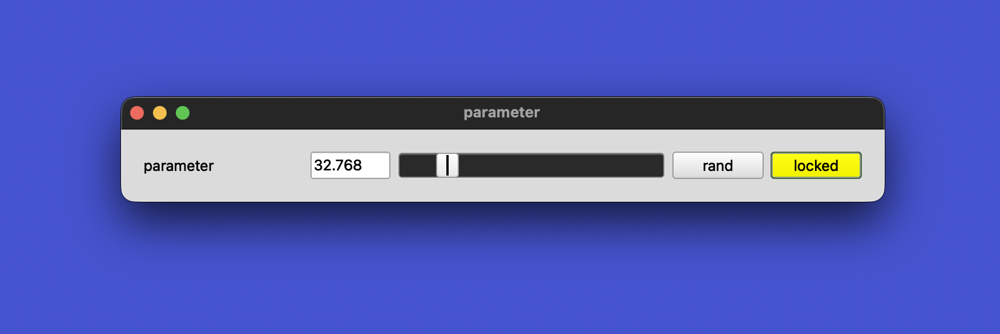
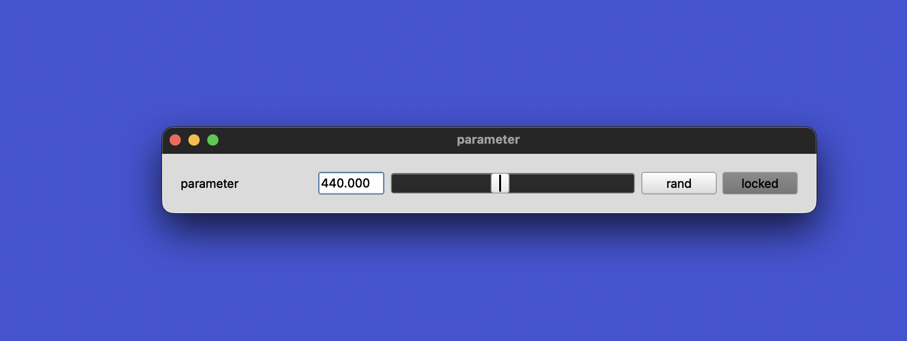
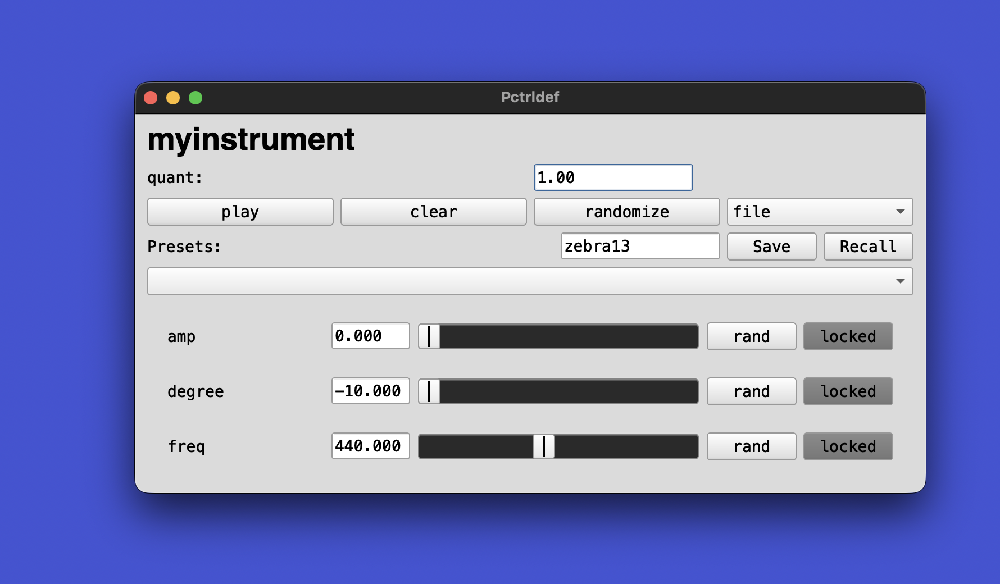
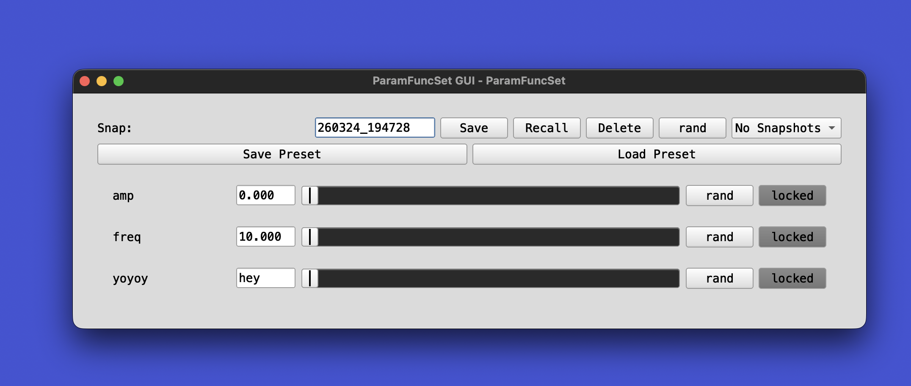

# Performative

This library is a set of tools designed to help you design performative instruments and/or compositions in SuperCollider.

One of the main goals of this library is to create a framework for managing and designing *musical perameters*: Parameters that contain compositional decision making and encourage structural improvisation.

Interacting with the parameters should be as easy as possible. For this reason, all of them can be either set with direct values or using a normalized range of floating point numbers as inputs (0.0 to 1.0) — this makes it simple to map them to controllers, and it allows the creation of automatic GUI's, randomization, snapshots and other convenient tricks for interacting with them in complex and fun ways.

## Support

Making this took a long time and effort. If you find it useful, please consider supporting with a donation:

[](https://ko-fi.com/X8X6RXV10)

## Installation

Open up SuperCollider and evaluate the following line of code:
`Quarks.install("https://codeberg.org/madskjeldgaard/Performative")`

## Classes

Generally: Most classes have a GUI and you can choose between the class and it's def-style cousin - the two versions being the same, but the latter being stored in a global dictionary for easy access for live-coding.

### Specs

[Specs in the standard supercollider class](https://doc.sccode.org/Classes/ControlSpec.html) library describe a range, units, warping, default value, etc. for a simple number. These objects are useful for creating GUI's and generally abstracting a parameter's values to a normalized range of 0.0 to 1.0.

*Performative* adds an extra kind of spec called ArrayedSpec which lets you use a list of choices of objects of any kind, instead of a range of numbers.

An ArrayedSpec can contain *any object*, which allows enormous flexibility in the parameters in this library. 

```supercollider
a = ArrayedSpec([\hey, \ho, \yo])

a.map(0.0) // -> hey
a.map(0.5) // -> ho
a.map(1.0) // -> yo
```

### ParamFunc: A simple parameter object



An object that represents a _parameter_: It has a spec defining it's range, etc., an automated gui, randomization, locking (to avoid parameters being changed by randomization or snapshot recalls / presets (see further down)). It's defined with a callback function that is called every time the output parameter changes and passed the mapped value and the object itself. This component and its GUI is used to represent any single parameter throughout the library.


```supercollider
(
p = ParamFunc.new(
    {|mapped, obj|
        "New values. Mapped to spec range: %, obj: %".format(mapped,obj).postln
    },

    // A spec with fluid controls
    [10.0,20000.0,\exp].asSpec
    // Alternative: A spec with fixed choices:
    // [261, 523, 784, 1046, 1308]
);

p.set(0.1);
p.set(0.25);
p.set(0.5);
p.set(0.75);
p.randomize();
p.gui;
)
```

### Pparam / PparamDef: A pattern parameter



Pparam and it's def-style cousin PparamDef are pattern-based parameters. They can be used to allow live-coding/changing a parameter inside a pattern for example, to make that pattern controllable from the outside. It has the same gui as ParamFunc and is a standard PatternProxy, so its changes may be quantized to the clock to synchronize it with your music.

```supercollider
(
// Make a parameter for freq
p = Pparam.new(500, Spec.specs[\freq]);

// Quantize changes to every beat
p.quant_(1);

s.waitForBoot{
    Pbind(\freq, p).play;
}
)

p.gui;
```

Since a parameter may contain an array of any kind of object, it also allows making a parameter consisting of patterns or a mix of objects.

Here is an example of a parameter that contains melodies and chords:

```supercollider
(
// Use patterns for the parameter
var choices = [
    0,
    4,
    5,
    Pseq([0,2,4],inf),
    Pseq([5,4,2],inf),
    Pseq([0,5,4,2,5,7],inf),
    [0,2,4,6]
];

p = Pparam.new(choices.first, choices);

s.waitForBoot{
    Pbind(\degree, p, \dur, 0.25).play;
}
)

p.gui;
```

### Pcontrol / Pctrldef: Instruments based on Event Patterns



Pcontrol and it's def-style cousin Pctrldef are instruments based on Event Patterns. They contain parameters (*Pparams*), have an automatic GUI and an environment for sharing the data from the parameters to the pattern. They are defined with an initial function that is called to construct the final pattern, this function is fed the object itself which allows easy access to all the parameters defined in it.

It comes with an automatic GUI that allows controlling all parameters, randomizing them, locking them, etc.

*Features*:
- Parameters and Pbind in one easy to use environment
- Presets: Save/load presets
- Export as MIDI: Create a midi file from the pattern
- GUI with controls for each parameter, automatically made from the defined parameters, also including an overall control section with randomization and preset management

```supercollider
(
// Create a Pcontrol
Pctrldef(\myinstrument, { |pc|
    pc.addParam(\degree, 0, [-10,10, \lin, 1].asSpec);
    pc.addParam(\amp, 0.1, [0, 1, \lin].asSpec);
    pc.addParam(\scale, Scale.major, [Scale.minor, Scale.major, Scale.melodicMinor]);

    Pbind(
        \scale, pc[\scale].trace,
        \degree,  pc[\degree].trace,
        \amp, pc.at(\amp).trace,
        \dur, 0.25,
    )
});

// Create and show the GUI
Pctrldef(\myinstrument).gui;

s.waitForBoot{ Pctrldef(\myinstrument).play };
)
```

### ParamFuncSet / ParamsDef: A set of parameters that can control anything 



Encapsulates a collection of parameters for easy access and management. Each parameter is a *ParamFunc* with a callback function that is called every time the parameter changes. This allows you to easily create a set of parameters that can be used to control anything you want, for example a Pbind or a MIDI output, etc. It also has snapshot and restore functionality that allows you to save and restore the state of all parameters in the set, as well as a GUI.

The def-version is simply called ParamsDef.

```supercollider
(
p = ParamFuncSet();
p.add(\freq, {|mapped, obj| "Freq mapped: %, obj: %".format(mapped, obj).postln}, [10.0, 20000.0, \exp].asSpec);
p.add(\amp, {|mapped, obj| "Amp mapped: %, obj: %".format(mapped, obj).postln}, \amp.asSpec);
p.add(\yoyoy, {|mapped, obj| "Yoyo mapped: %, obj: %".format(mapped, obj).postln}, [\hey, \yo, \hi]);
p.gui;
)

p.randomizeAll()
p.snapshot(\one)

p.snapshots[\one]

p.randomizeAll()
p.snapshot(\two)

p.restoreSnapshot(\one)

p[\yoyoy].set(\hey);

p[\freq].set(0.5);

```

## Development

To make this library as robust as possible, everything is automatically tested with unit tests. Any time changes are made, it should be reflected in the test-suite to make sure that this remains a solid and trust-worthy foundation for performance- and composition-setups.  

To test all classes, in SuperCollider run: 

```supercollider
PerformativeTest.runAll();
```

If you experience bugs or issues, please open an issue on [codeberg](https://codeberg.org/madskjeldgaard/Performative/).
